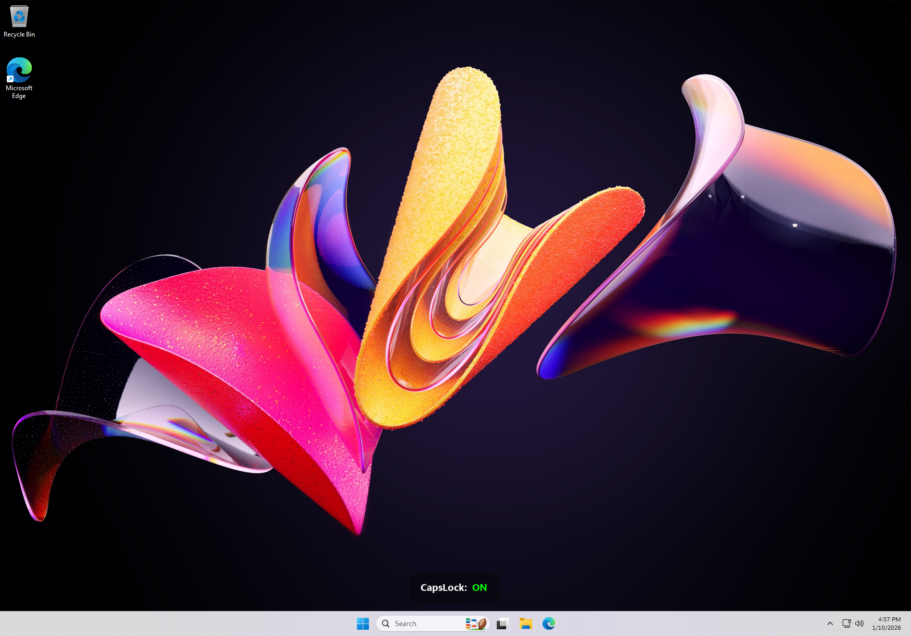

# OSD Lock Indicator

<div align="center">

**A beautiful, ultra-lightweight Windows utility that displays an elegant on-screen notification when Caps Lock or Num Lock is toggled.**


[Features](#-features) • [Installation](#-installation) • [Customization](#%EF%B8%8F-customization) • [Building](#-building-from-source)

</div>

---

## 🌟 Why This Exists

Ever accidentally typed in ALL CAPS because you didn't notice Caps Lock was on? Or struggled to see if Num Lock is enabled on your keyboard? This lightweight utility solves that with a beautiful, non-intrusive on-screen display.

Unlike bloated alternatives that consume 15-25 MB of RAM, **OSD Lock Indicator** uses just **1.6 MB** while delivering a polished, professional experience.

---

## ✨ Features

### Visual Excellence
- 🎨 **Beautiful Design** - Smooth rounded corners with anti-aliased rendering
- 🌈 **Color-Coded Status** - Green for ON, Red for OFF
- ✨ **Smooth Animations** - Elegant fade-in and fade-out transitions
- 🔍 **Perfect Clarity** - Semi-transparent background with 100% opaque text

### Performance
- ⚡ **Ultra-Lightweight** - Just 227 KB executable size
- 🚀 **Minimal Memory** - Uses only 1.6 MB of RAM
- 💨 **Instant Startup** - Launches in milliseconds
- 🎯 **Zero Dependencies** - No .NET framework or runtime required

### Functionality
- 🖥️ **Multi-Monitor Support** - Automatically displays on the active screen
- 🎮 **Game-Friendly** - Click-through window that never steals focus
- 🔝 **Always Visible** - Stays on top of all applications
- 🔄 **Auto-Start** - Automatically launches with Windows
- 🎯 **Text Stabilization** - No wiggling when toggling between ON/OFF

### Compatibility
- ✅ **Windows 11** - Fully supported
- ✅ **High DPI Displays** - Crystal clear on any resolution
- ✅ **Borderless Windowed Games** - Works seamlessly
- ✅ **Multiple Keyboards** - Detects any keyboard input

---

## 📸 Screenshots

### Caps Lock - ON


### Num Lock - OFF


---

## 🚀 Installation

### Quick Start (Recommended)

1. **Download** the latest release from the [Releases](../../releases) page
2. **Extract** `OsdLockIndicator.exe` to any folder
3. **Run** the executable
4. That's it! The indicator will start automatically and add itself to Windows startup

### Portable Usage

Simply copy `OsdLockIndicator.exe` to a USB drive and run it on any Windows PC. No installation needed!

## 🗑️ Uninstall

### Complete Removal (Recommended)

1. **End the process** (if running):
   - Open Task Manager (`Ctrl+Shift+Esc`)
   - Find `OsdLockIndicator.exe` and end task

2. **Navigate to the folder:**
   - Open the folder where `OsdLockIndicator.exe` is located
   - Hold `Shift` and right-click on empty space in the folder
   - Select **"Open in Terminal"** (or **"Open PowerShell window here"** on older systems)

3. **Run the uninstall command:**
   ```powershell
   .\OsdLockIndicator.exe /uninstall
   ```
   
   A message will appear confirming removal from Windows startup.

4. **Delete the file:**
   - Close the terminal
   - Delete `OsdLockIndicator.exe`

### Alternative: Manual Removal

If you've already deleted the file without running the uninstall command:

1. Press `Win + R`, type `regedit`, press Enter
2. Navigate to: `HKEY_CURRENT_USER\SOFTWARE\Microsoft\Windows\CurrentVersion\Run`
3. Find and delete the `OsdLockIndicator` entry
4. Close Registry Editor

---

## ⚙️ Customization

You can customize the appearance by modifying the constants at the top of the source code and rebuilding:

```cpp
// Window Dimensions
constexpr int OSD_WIDTH = 175;        // Width in pixels
constexpr int OSD_HEIGHT = 60;        // Height in pixels
constexpr int CORNER_RADIUS = 20;     // Roundness of corners

// Visual Settings
constexpr int BG_ALPHA_MAX = 80;      // Background transparency (0-255)
                                      // Lower = more transparent
                                      
constexpr int SCREEN_HEIGHT = 75;     // Distance from bottom of screen

// Animation Settings
constexpr int FADE_SPEED = 25;        // Fade speed (higher = faster)
constexpr int ANIM_DELAY = 10;        // Animation frame delay (ms)
constexpr int STAY_TIME = 1500;       // Display duration (ms)
```

### Customization Examples

**More Transparent Background:**
```cpp
constexpr int BG_ALPHA_MAX = 50;  // Very transparent
```

**Larger Display:**
```cpp
constexpr int OSD_WIDTH = 200;
constexpr int OSD_HEIGHT = 80;
```

**Longer Display Time:**
```cpp
constexpr int STAY_TIME = 2500;  // 2.5 seconds
```

**Higher on Screen:**
```cpp
constexpr int SCREEN_HEIGHT = 150;  // 150px from bottom
```

---

## 🔧 Building from Source

### Prerequisites

- **Windows 11**
- **Visual Studio 2026** (or later) with C++ Desktop Development workload
- **Windows SDK** (included with Visual Studio)

### Build Steps

1. **Clone the repository:**
   ```bash
   git clone https://github.com/DopeMSR/OsdLockIndicator.git
   cd Osdlockindicator
   ```

2. **Open in Visual Studio:**
   - Open `OsdLockIndicator.sln`
   - Or create a new C++ Windows Desktop Application project and add `OsdLockIndicator.cpp`

3. **Configure for Release:**
   - Set configuration to **Release**
   - Set platform to **x64**

4. **Build:**
   - Press `Ctrl+Alt+B` or select **Build → Build Solution**
   - Find the executable in `x64/Release/OsdLockIndicator.exe`

### Build Optimization Settings

For the smallest file size, ensure these settings are enabled:

**Project Properties → C/C++ → Optimization:**
- Optimization: `Minimize Size (/O1)` or `Maximize Speed (/O2)`
- Favor Size or Speed: `Favor small code (/Os)`

**Project Properties → C/C++ → Code Generation:**
- Runtime Library: `Multi-threaded (/MT)`

**Project Properties → Linker → General:**
- Enable Incremental Linking: `No`

**Project Properties → Linker → Debugging:**
- Generate Debug Info: `No`

---

## 🎮 Gaming Notes

This overlay works seamlessly with most games running in **Borderless Windowed** or **Windowed** mode.

### Exclusive Fullscreen Games

Some older games use exclusive fullscreen mode, which may hide the overlay. Solutions:

1. Switch the game to **Borderless Windowed** mode (recommended)
2. Use a borderless gaming tool to convert fullscreen to borderless
3. Alt+Tab out to see the notification

Most modern games support borderless windowed mode natively.

---

## 🔍 Technical Details

### Architecture
- **Language:** C++20
- **UI Framework:** Win32 API
- **Graphics:** GDI+ with hardware acceleration
- **Rendering:** Per-pixel alpha blending via `UpdateLayeredWindow`

### Window Properties
- **Style Flags:** `WS_EX_LAYERED | WS_EX_TOPMOST | WS_EX_TOOLWINDOW | WS_EX_NOACTIVATE | WS_EX_TRANSPARENT`
- **Click-Through:** Yes - won't interfere with clicking on applications beneath it
- **Focus Stealing:** No - won't minimize or interrupt your active window
- **Always on Top:** Yes - visible over all other windows

### Keyboard Hook
- **Type:** Low-level keyboard hook (`WH_KEYBOARD_LL`)
- **Scope:** Global - detects all keyboard input
- **Keys Monitored:** Caps Lock (`VK_CAPITAL`), Num Lock (`VK_NUMLOCK`)
- **State Detection:** Uses `GetKeyState` to accurately read lock state

### Performance Benchmarks

| Metric | Value |
|--------|-------|
| Executable Size | 227 KB |
| RAM Usage (Idle) | 1.6 MB |
| RAM Usage (Active) | 1.7 MB |
| CPU Usage (Idle) | <0.1% |
| CPU Usage (Animating) | ~0.3% |
| Startup Time | ~15 ms |
| GDI Objects | 4-6 |

---

## 📊 Comparison to Alternatives

| Feature | OSD Lock Indicator | Typical Alternatives |
|---------|-------------------|---------------------|
| **File Size** | 227 KB | 2-15 MB |
| **RAM Usage** | 1.6 MB | 8-25 MB |
| **Dependencies** | None | .NET, Java, or other runtimes |
| **Visual Quality** | Anti-aliased, smooth | Varies |
| **Startup Time** | 15 ms | 200-500 ms |
| **Multi-Monitor** | ✅ Yes | Sometimes |
| **Game Compatible** | ✅ Yes | Sometimes |
| **Auto-Start** | ✅ Yes | ✅ Yes |

---

## 🤔 FAQ

### Q: Does this work with laptop keyboards?
**A:** Yes! It works with any keyboard - built-in laptop keyboards, USB keyboards, Bluetooth keyboards, etc.

### Q: Will this slow down my computer?
**A:** No. It uses only 1.6 MB of RAM and barely any CPU. It's more efficient than most system tray icons.

### Q: Can I use this on multiple monitors?
**A:** Yes! The indicator automatically appears on whichever monitor your mouse cursor is on.

### Q: Does this work with games?
**A:** Yes, for games running in Borderless Windowed or Windowed mode. Exclusive fullscreen may hide the overlay.

### Q: How do I stop it from auto-starting?
**A:** End the process in Task Manager, then delete it. It removes itself from startup when deleted.

### Q: Is this safe? My antivirus flagged it.
**A:** Yes, it's completely safe. Some antivirus programs flag any software that uses keyboard hooks as potentially suspicious. This is a false positive - the source code is available for review.

### Q: Can I customize the colors?
**A:** Currently, colors are hardcoded (green for ON, red for OFF, white for label). You can modify the source code and rebuild to change them.

### Q: Why doesn't it show Scroll Lock?
**A:** Scroll Lock is rarely used on modern systems. The code can be easily modified to include it if needed.

### Q: How do I uninstall this properly?
**A:** Don't just delete the file! First, run the uninstall command to remove it from Windows startup:
1. Navigate to the folder with the .exe
2. Hold `Shift` + right-click on empty space → **"Open in Terminal"**
3. Run: `.\OsdLockIndicator.exe /uninstall` in PowerShell or `OsdLockIndicator.exe /uninstall` in CMD
4. Then delete the file

This ensures the registry entry is cleaned up properly.

---

## 🛡️ Privacy & Security

- ✅ **No telemetry** - Doesn't connect to the internet
- ✅ **No data collection** - Doesn't log or store any information
- ✅ **No admin required** - Runs with standard user privileges
- ✅ **Open source** - Full source code available for review
- ✅ **Minimal permissions** - Only uses keyboard hook and window creation

**What it does:**
- Monitors Caps Lock and Num Lock key states
- Displays an on-screen notification
- Adds itself to Windows startup registry (`HKEY_CURRENT_USER\SOFTWARE\Microsoft\Windows\CurrentVersion\Run`)

**What it doesn't do:**
- Capture or log keystrokes
- Send data over the network
- Modify system files
- Require elevated permissions

---

## 🐛 Troubleshooting

### The indicator doesn't appear

1. **Check if it's running:**
   - Open Task Manager (`Ctrl+Shift+Esc`)
   - Look for `OsdLockIndicator.exe` in the Processes tab

2. **Check display settings:**
   - The indicator appears 75 pixels from the bottom of your screen
   - Try pressing Caps Lock/Num Lock with Task Manager open to see if it appears

### Multiple instances are running

- Only one instance should run at a time due to mutex protection
- If multiple instances appear in Task Manager, end all of them and restart

### The indicator appears on the wrong monitor

- The indicator follows your mouse cursor
- Move your mouse to the desired monitor before pressing Caps/Num Lock

### Antivirus is blocking it

- Add an exception for `OsdLockIndicator.exe` in your antivirus software
- This is a false positive - keyboard hooks are flagged by some antivirus programs

---

## 📝 License

This project is licensed under the **MIT License**.

```
MIT License

Copyright (c) 2025 Dope M.S.R. (github.com/DopeMSR)

Permission is hereby granted, free of charge, to any person obtaining a copy
of this software and associated documentation files (the "Software"), to deal
in the Software without restriction, including without limitation the rights
to use, copy, modify, merge, publish, distribute, sublicense, and/or sell
copies of the Software, and to permit persons to whom the Software is
furnished to do so, subject to the following conditions:

The above copyright notice and this permission notice shall be included in all
copies or substantial portions of the Software.

THE SOFTWARE IS PROVIDED "AS IS", WITHOUT WARRANTY OF ANY KIND, EXPRESS OR
IMPLIED, INCLUDING BUT NOT LIMITED TO THE WARRANTIES OF MERCHANTABILITY,
FITNESS FOR A PARTICULAR PURPOSE AND NONINFRINGEMENT. IN NO EVENT SHALL THE
AUTHORS OR COPYRIGHT HOLDERS BE LIABLE FOR ANY CLAIM, DAMAGES OR OTHER
LIABILITY, WHETHER IN AN ACTION OF CONTRACT, TORT OR OTHERWISE, ARISING FROM,
OUT OF OR IN CONNECTION WITH THE SOFTWARE OR THE USE OR OTHER DEALINGS IN THE
SOFTWARE.
```

**What this means:**
- ✅ Free to use commercially
- ✅ Free to modify and distribute
- ✅ No warranty provided
- ⚠️ Must include this license and copyright notice in copies

---

<div align="center">

**Made with ❤️ and C++**

*Developed with assistance from Claude (Anthropic) and Gemini (Google)*

[⬆ Back to Top](#osd-lock-indicator)

</div>